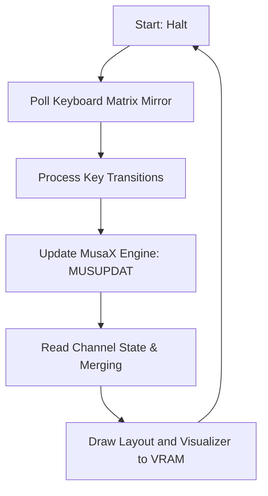

# Graphical Jukebox Design Plan for MusaX

This document outlines the technical design, screen layout, data mapping, and implementation phases for the Graphical Jukebox Test ROM in `src/jukebox/`.

---

## 1. Design Objectives

* **High Visual Appeal**: Transition from the current headless Z80 test ROM to an interactive, real-time graphical dashboard on MSX1 hardware/emulator.
* **Comprehensive Audio Monitoring**: Display real-time playback statistics for all 6 channels (3 Music streams + 3 SFX streams), showing volume level, active note, loaded instrument, 12-bit frequency period, and channel state.
* **Educational Demonstration**: Clearly visualize "Ghost Playback" by showing music channels advancing their notes/state even when overridden and muted by an active SFX channel.
* **Stable & Safe Integration**: Adhere to all workspace constraints, including direct RAM keyboard scanning (to avoid Page 1 cartridge conflicts) and strict uppercase, structured assembly code.

---

## 2. Display Mode & VRAM Architecture

To ensure universal compatibility across all MSX machines, the jukebox will run in **SCREEN 1 (32x24 Text Mode)**.

### VDP Register Settings (TMS9918 compatible)
* **R#0**: `0x00` (M2=0, M1=0)
* **R#1**: `0xA0` (16KB VRAM, screen enabled, interrupts enabled, 8x8 sprites, 32x24 text)
* **R#2**: `0x00` (Name Table / Layout Table at `#0000` - `#02FF`)
* **R#3**: `0x80` (Color Table at `#2000` - `#201F`)
* **R#4**: `0x01` (Pattern Generator / Character Patterns Table at `#0800` - `#0FFF`)
* **R#5**: `0x36` (Sprite Attribute Table at `#1B00`)
* **R#6**: `0x07` (Sprite Generator Table at `#3800`)
* **R#7**: `0xF0` (Text color 15 [White], Background color 0 [Black])

### Custom User-Defined Graphics (UDGs)
To display a smooth real-time volume visualizer, we will redefine character codes `0xE0` to `0xE8` in the Character Pattern Table (`#0800`) to represent fractional horizontal bar segments:
* `0xE0`: Empty block (8x8 space)
* `0xE1` to `0xE7`: Horizontal bars filled progressively from left to right (1/8 to 7/8 columns)
* `0xE8`: Fully filled 8x8 block

Using a 2-character wide field, we can map the 0..15 volume value with single-step precision:
* `Full Blocks = Volume / 8`
* `Remainder   = Volume % 8`

---

## 3. UI Layout Specification

Below is the character-accurate 32x24 grid layout for the MSX screen:

```text
00:  MUSAX GRAPHICAL JUKEBOX v1.9   
01: ────────────────────────────────
02:  PLAYLIST         PLAYBACK INFO 
03:  1.SHALOMCASTLE   Song: SHALOM  
04:  2.ADSR_TEST      BPM : 120     
05:  3.LFO_TEST       Vol : 15/15   
06:  4.SEQ_TEST       Loop: 00/INF  
07:  5.MOD_TEST       Stat: PLAYING 
08:  6.SFX_PRIORITY   Fade: INACTIVE
09: ────────────────────────────────
10: CH TY VOL   NOTE INS  PER  STAT 
11: 0A MU ████  A#4   02  #1FA PLAY 
12: 1B MU ███▏  F-3   02  #2AC PLAY 
13: 2C MU █     C-2   01  #5C2 PLAY 
14: 3A FX ░░░░  ---   --  #000 OFF  
15: 4B FX ░░░░  ---   --  #000 OFF  
16: 5C FX ░░░░  ---   --  #000 OFF  
17: ────────────────────────────────
18:  SFX: 7:LO  8:HI  9:FAN  0:TRI  
19: ────────────────────────────────
20:  KEYS: 1-6 Select | S Stop      
21:        F Fade Out | I Fade In   
22:        C Porta    | D Detune    
23:        E Chorus                 
```

### Visual Behaviors
* **Selection Cursor**: The currently playing song (1-6) will have a highlighted text attribute or color.
* **Volume Bars**:
  * **Music Channels (0A-2C)**: Rendered using solid blocks `█` (`0xE8` / `0xE1-0xE7`).
  * **SFX Channels (3A-5C)**: Rendered using stippled/dotted blocks `░` (`0x7F` or custom shade) to distinguish them from music.
* **Mute/Ghost Visualization**: If SFX overrides a music channel (e.g. channel A is active in `SFXMSK`), the music channel (0A) volume bar turns off or dims, and its `STAT` column prints `GHST` (Ghost) instead of `PLAY`. The note name continues to update in real-time, showing the sequence running underneath.

---

## 4. Technical Implementation & Data Mapping

The user interface code will scan RAM variables inside Page 3 RAM (`#E000` onwards) at 50Hz/60Hz:

### Channel Data Table
For channel index `i` (0 to 5), the RAM state is located at address `CHANNELS + (i * 32)`:

| Field | Offset | Size | Description |
|---|---|---|---|
| `CHPC` | `0` | 2 bytes | Program Counter (verifies execution activity) |
| `CHVOL` | `7` | 1 byte | Channel base volume (0..15) |
| `CHINST` | `9` | 2 bytes | Instrument pointer (maps to ID by looking up offset in `INSTTBL`) |
| `CHFLAGS` | `18` | 1 byte | Channel status flags (Bit 0: Active, Bit 1: Muted/Loop, etc.) |
| `CHNOTE` | `20` | 1 byte | Current playing note index (0..95, or 255 for rest/silence) |

### Real-Time Overrides (`SFXMSK`)
* Read the 1-byte variable `SFXMSK` at `#E000` offset:
  * Bit 0 set to 1 $\rightarrow$ Music Ch A overridden by SFX Ch A (channel index 3 overrides channel index 0).
  * Bit 1 set to 1 $\rightarrow$ Music Ch B overridden by SFX Ch B (channel index 4 overrides channel index 1).
  * Bit 2 set to 1 $\rightarrow$ Music Ch C overridden by SFX Ch C (channel index 5 overrides channel index 2).

### Note Code to String Mapping
A 288-byte look-up table in ROM contains 3-character note names:
```assembly
NOTENAMES:
    DEFB "C-0C#0D-0D#0E-0F-0F#0G-0G#0A-0A#0B-0"
    DEFB "C-1C#1D-1D#1E-1F-1F#1G-1G#1A-1A#1B-1"
    ; ... Up to Octave 7
```
If `CHNOTE` is `255`, the UI prints `---`. Otherwise, it multiplies `CHNOTE` by 3, adds it to `NOTENAMES`, and copies 3 characters to VRAM.

### Frequency / Period Extraction
The current frequency period (12-bit value) will be read directly from the PSG shadow registers:
* **Music Periods**:
  * Channel A: `PSGMUS + 0` (low byte), `PSGMUS + 1` (high 4 bits)
  * Channel B: `PSGMUS + 2` (low byte), `PSGMUS + 3` (high 4 bits)
  * Channel C: `PSGMUS + 4` (low byte), `PSGMUS + 5` (high 4 bits)
* **SFX Periods**:
  * Channel A: `PSGSFX + 0` (low byte), `PSGSFX + 1` (high 4 bits)
  * Channel B: `PSGSFX + 2` (low byte), `PSGSFX + 3` (high 4 bits)
  * Channel C: `PSGSFX + 4` (low byte), `PSGSFX + 5` (high 4 bits)

---

## 5. Control Flow & Loop Architecture

The main execution loop in `test.Z8A` will follow this cycle:



### Interrupt Service Routine (ISR)
The ISR hooked at `HTIMI` (`#FD9F`) remains extremely lightweight, performing only the physical PSG commit:
```assembly
IRQINT:
    CALL    MUSCOMM      ; Commit merged shadow register buffer to physical PSG
    RET
```

---

## 6. Implementation Phases

1. **Phase 1: Screen Mode & Font Setup**:
   * Set up VDP Screen 1 registers.
   * Redefine font characters for borders, indicators, and volume bars (`0xE0`-`0xE8`).
   * Implement string-copy-to-VRAM utility.

2. **Phase 2: Static Frame Layout**:
   * Render the layout skeleton (borders, playlist text, legends, headers).

3. **Phase 3: Real-Time Variables Display**:
   * Print dynamic data from global state (`BPM`, `Vol`, `Loop`, `Stat`, `Fade`).

4. **Phase 4: Channel State Display**:
   * Parse `CHANNELS` and PSG shadows to render real-time volumes, notes, loaded instruments, and frequency periods.
   * Apply priority blending visualization (fade music bars and mark `GHST` status when overridden by SFX).

5. **Phase 5: Refinement & Testing**:
   * Verify on emulator (`m1 ntsc`) and optimize code size and CPU usage.

---

## 7. Jukebox v2.0 Optimizations & Cache Control

Jukebox v2.0 implements several visual caching strategies and CPU cycles optimizations to maintain a rock-solid 60Hz playback and avoid dropped frames:

* **UI Cache Reset Subroutines (`CLRUI` & `RESETUI`):**
  * `CLRUI`: Invalidate all visual caches (setting previous visual status values to `#FF` inside `CHCACHE` and `SONGPREV`). This forces redrawing on the next frame.
  * `RESETUI`: Invokes `CLRUI`, clears the 768-byte screen buffer (`SCRBUFF`) with spaces (`#20`), and calls `INITLAY` to draw the layout borders from scratch. Called on startup, song change, or playback stop.
* **BPM Caching via `BPMPREV`:**
  * Compares the 16-bit BPM step value (`CHANNELS + CHBPM` from the active channel) with the cached value in `BPMPREV` using 16-bit subtraction (`SBC HL, DE`).
  * If unchanged, the visualizer completely bypasses the expensive `GETBPM` routine (saving ~1,900 T-states of loop divisions every frame on the fast path).
* **Mute Bit Table (`MUTEBIT`):**
  * Employs a direct lookup table to map active channel mute states, replacing expensive `SRL` bit-shifting loops.
* **Name Caching (`NAMEPRV`):**
  * Tracks the active song name index. Bypasses song name string lookup and `PUTSTR` rendering into the RAM buffer if the playing song has not changed.
* **Selective Screen Invalidation:**
  * Navigation inputs (`UP`, `DOWN`, `LEFT`, `RIGHT`) and Mute inputs (`T`, `Y`, `U`, `G`, `H`, `J`) selectively update only the changed visual cells. They do not trigger global visual cache clears (`CLRUI`), avoiding visual flicker and CPU spikes.
* **Visualizer Grid Revisions:**
  * The redundant logical channel column is replaced by a single `CH` column showing the hardware channels (`A`, `B`, `C`).
  * Added a signed real-time `LFO` modulation visualizer column (`PRNLFO` subroutine rendering signed values, e.g., `+03` or `-12`).

